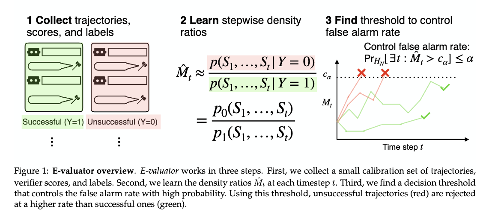

# E-valuator
[](https://github.com/shuvom-s/e-valuator/blob/main/LICENSE)
[](https://pypi.org/project/e-valuator/)
[](https://pepy.tech/projects/e-valuator)
[](https://arxiv.org/abs/2512.03109)
[](https://colab.research.google.com/github/shuvom-s/e-valuator/blob/main/demos/notebooks/math_example_tokens.ipynb)


Code for paper [_E-valuator: Reliable Agent Verifiers with Sequential Hypothesis Testing_](https://arxiv.org/abs/2512.03109). We build a sequential evaluator that can convert any black-box verifier/agent system into one with statistical guarantees. At deployment time, our system can flag and terminate agent trajectories that are likely to be unsuccessful without access to anything but a verifier's (black-box) scores.

To learn more details about the method, please see the paper. There is also a [recorded talk](https://www.youtube.com/watch?v=Xxlhh019cWM) to the [Rational Intelligence Seminar](https://ri-lab.org/riss/) available on YouTube.



## Install
To start, please install our package:

```bash
pip install e-valuator
```

## Data
E-valuator requires a dataframe with at least four columns: (1) uq_problem_idx, a unique identifier for each trajectory, (2) num_steps, indicating the step count of the trajectory thus far, (3) judge_probability, indicating the verifier score for that particular step (could also be real-valued, doesn't have to be in 0-1), and (4) solved, a binary indicator column indicating whether the agent successfully solved the problem or not. Details on the data are provided in quick start. Here's an example of a minimal dataframe for e-valuator:

| uq_problem_idx  | num_steps| judge_probability | solved |
| :---            | :---:    | :---:             | :---:  |
| `algebra_1`     | 1        | 0.995             | 1      |
| `algebra_1`     | 2        | 0.996             | 1      |
| `algebra_1`     | 3        | 0.969             | 1      |
| ...             | ...      | ...               | ...    |
| `precalculus_5` | 5        | 0.538             | 0      |
| `precalculus_5` | 6        | 0.544             | 0      |
| `precalculus_5` | 7        | 0.465             | 0      |

You are welcome to add other columns (e.g., metadata about the problem, token counts, etc.) but these additional columns will not be used in our package.

## Quick start
You can quickly try out our demo code in Colab (click on the badge at the top of this README).

We provide two demo notebooks (and corresponding datasets) in `demos/notebooks/hotpot_example.ipynb` (corresponding dataset in `data/hotpotqa_w_scores_compressed.csv.gz`) and `demos/notebooks/math_example_tokens.ipynb` (corresponding dataset in `data/math_w_scores_compressed.csv.gz`). These notebooks provide examples of the input data format required and evaluation pipeline. The workflow for e-valuator consists of three parts:

1. **Collect agent trajectories and verifier scores**. We provide an example collection script in `demos/collect_verifier_scores/collect_math_example.py`. As noted in the data section, the trajectories and scores used to calibrate e-valuator must be stored in a csv file (or similar) with (at least) four columns: (1) uq_problem_idx, (2) num_steps, (3) judge_probability, and (4) solved. The columns need not use exactly these names, but if you use a different naming system, you'll need to mark them appropriately upon initialization of e-valuator.

2. **Fit density ratio estimates on calibration set**. Using the calibration set collected in step (1), we'll fit a stepwise density ratio estimator with a binary classifier.

3. **Apply learned density ratio estimates at test time**. We can then apply our learned density ratios from step (2) at test time for _online_ and _sequential_ monitoring of agent trajectories. In particular, given a (black-box) agent's trajectory and corresponding stepwise verifier scores, we can apply e-valuator to terminate poor trajectories.

To start e-valuator:

```python
import evaluator as e_val
ev = e_val.EValuator(
    model_type="logistic",   
    mt_variant="PAC",    ## "PAC" is the variant where we find the threshold empirically from null samples in the calibration set. "RandVille" uses Randomized Ville's inequality, which controls the false alarm rate, but only for exact density ratios.
    alphas=[0.01, 0.05, 0.1, 0.2, 0.3, 0.4, 0.5],
    ## Note: we split the PAC budget alpha as: alpha' = w0*alpha, delta' = w1*alpha using alpha_delta_weights=(w0, w1). Then, by a union bound, the total false alarm rate is controlled within alpha.
    ## Default is (0.9, 0.1). To change, uncomment and change line below:
    # alpha_delta_weights=(0.9, 0.1),
    split_fraction=0.5 ## fraction of the calibration split used for learning density ratios vs setting threshold. by default, it's set to 0.5, or equal parts for each split. only used for e-valuator (i.e., PAC version). Not used for anything else.
)
```

You now have an e-valuator object that will fit the density ratio estimate using logistic regression. It will find a valid threshold for e-valuator, using the list of $\alpha$ values provided. Note that the total budget is $\alpha$, which we split into $\alpha'$ and $\delta$. It's possible there are too few calibration samples to find a valid threshold from the calibration set. This happens when there are too few successful trajectories in the calibration split, i.e., $n < \log \delta / \log(1-\alpha')$. In such a case, the threshold used is $c_\alpha = \text{np.inf}$, which corresponds to never rejecting a trajectory (thus trivially controlling the false alarm rate). E-valuator throws a warning when $n$ is too small (see [here](https://github.com/shuvom-s/e-valuator/blob/main/src/evaluator/evaluator.py#L240)). We thus recommend setting $\alpha', \delta$ such that $c_\alpha$ is finite. 

You'll then need to fit e-valuator on a calibration dataframe that has the columns we described above:

```python
from evaluator.utils import add_judge_probability_series
## reformat the calibration dataframe
cal_df  = add_judge_probability_series(cal_df)
test_df = add_judge_probability_series(test_df)

## fit
ev.fit(cal_df)
```

To then apply it at test-time, you can run:

```python
test_df_with_evals = ev.apply(test_df)
```

## Online Evaluation/Monitoring of Agents
_E-valuator_ assumes black-box access to the verifier/agent system. As such, we do not provide code to directly intervene in any particular agent/verifier system. To deploy _e-valuator_ online, we recommend updating the test_df after each agent action/verifier score:

```python
import pandas as pd
from evaluator import EValuator

ev = EValuator(mt_variant="PAC", alphas=[0.05], split_fraction=0.5)
ev.fit(cal_df)                       # fit e-valuator thresholds and density ratios on some calibration dataframe

pid = "problem_new"
alpha = 0.05
reject_col = f"reject_PAC_alpha_{str(alpha).replace('.', '_')}"

prefix = []                          # judge scores so far for this trajectory
step = 1
while agent_not_done: # until agent finishes (or gets terminated inside this loop)
    score = verify(partial_traj_step)
    prefix.append(score)

    row = pd.DataFrame([{
        "uq_problem_idx": pid,
        "num_steps": step,
        "judge_probability_series": list(prefix),
    }])
    scored = ev.apply(row)

    if bool(scored.iloc[0][reject_col]):
        terminate(); break
    step += 1
```

## Baselines
We compare to several baselines, which are available in `baselines/run_baselines.py`. The baselines are:

1. PAC verifier. For this baseline, we use PAC thresholding, but just on the raw scoredes.
2. Randomized Ville. Uses a [randomized variant of Ville's inequality](https://arxiv.org/abs/2304.02611) to set the rejection threshold.
3. Calibrated verifier. Runs a small calibration procedure atop the raw verifier, then rejects whenever the raw score drops below $\alpha$.
4. Raw verifier. Same as above, without any calibration.

## Citation
If you use this code, please cite our work:

```
@article{sadhuka2025valuator,
  title={E-valuator: Reliable Agent Verifiers with Sequential Hypothesis Testing},
  author={Sadhuka, Shuvom and Prinster, Drew and Fannjiang, Clara and Scalia, Gabriele and Regev, Aviv and Wang, Hanchen},
  journal={arXiv preprint arXiv:2512.03109},
  year={2025}
}
```

## Contact and miscellaneous
Feel free to contact shuvom@csail.mit.edu with any questions.